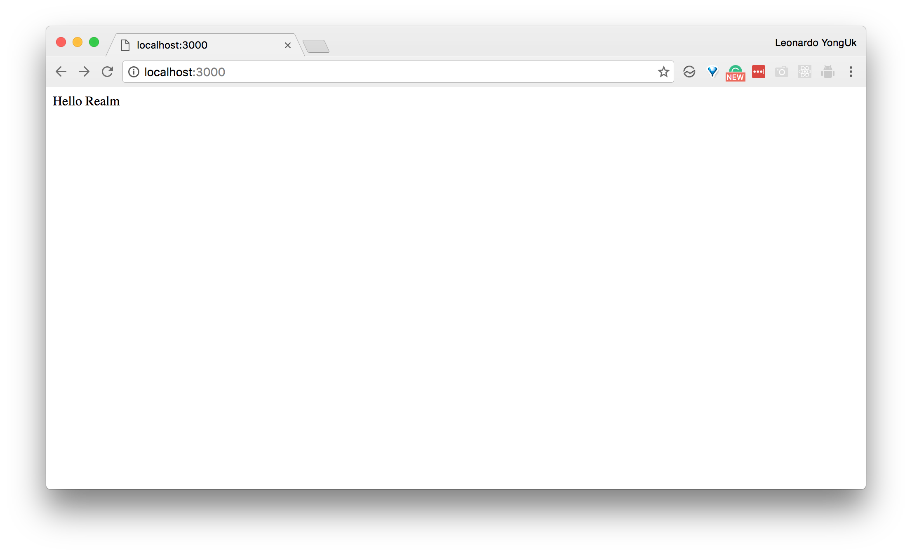
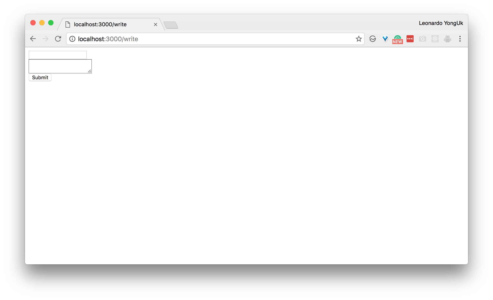
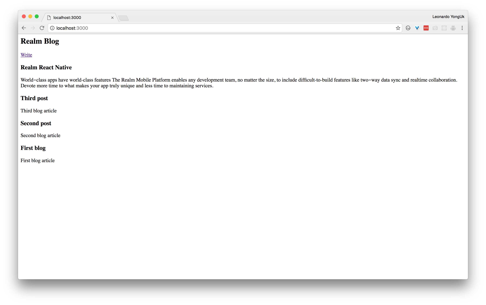

# Building a blog with Realm Node.js and Express

Author: Leonardo YongUk Kim <lk@realm.io>

[Realm Node.js was released on November 16th](https://realm.io/news/first-object-database-realm-node-js-server/) Realm's powerful features are available for the server side with Node.js now. In order to demonstrate how to use Realm, let's build a simple blog.

This tutorial assumes you already use macOS or Linux environment to use the shell environment, and Node.js and `npm` are also installed. If they are not installed yet, please see [here](https://nodejs.org/en/) to install them.

## Setting the default environment

I'll start with a directory named `realm-blog`.

```
mkdir realm-blog
cd realm-blog
```

First of all, in order to initialize the Node.js project, use the `npm init` command.

```
$npm init
```

```
name: (realm-blog)
version: (1.0.0) 0.1.0
description: Realm Blog
entry point: (index.js)
test command:
git repository:
keywords:
author:
license: (ISC)
```

I filled the above entries appropriately. The `name` entry is specified as the project's directory name automatically, we can just use it as it is. Since it is a very first stage project, I changed its version from `1.0.0` to `0.1.0`. All other entries are set to default values.

It will use Express to handle web requests, Realm Node.js for the database, Embedded JavaScript (EJS) to process its templates, and body-parser to parse quires which are passed from the form.

```
npm install --save express
npm install --save realm
npm install --save ejs
npm install --save body-parser
```

Next, install Nodemon so that the server will restart whenever you modify the code.

In order to run the server using Nodemon now, you can use the `node_modules/nodemon/bin/nodemon.js index.js` command. Because it is a bit cumbersome, we will make a short form command to run.


```
{
  ...
  "scripts": {
    "serve": "nodemon index.js"
  },
  ...
}
```

Now then, you can run the test server as `npm run serve`.

## Hello Realm!

First, lets register the code to handle the `/` requests.


```
'use strict';

var express = require('express');

var app = express();

app.get('/', function(req, res) {
  res.send("Hello Realm");
});

app.listen(3000, function() {
  console.log("Go!");
});
```

When the server retrieves the GET requests from the path `/` and the port `3000`, it returns `Hello Realm`. Please open `localhost:3000` in your web browser.



### Implementing the write feature

Now let's implement the write feature. In order to make a write form, create the file `write.html` as follows:

```
<form action="/write" method="POST">
  <input type="text" name="title" /><br />
  <textarea name="content"></textarea><br />
  <button type="submit">Submit</button>
</form>
```

Add the following code to handle a `GET` request with the path `/write`.

```
app.get('/write', function(req, res) {
  res.sendFile(__dirname + "/write.html");
});
```

Whenever the server get the `/write` request, it returns the content of the file `write.html`.

Open `localhost:3000/write` in the web browser.



When you write a post, the server get a `POST` request with the path `/write`. Please append body-parser in your `index.js` first.

```
var express = require('express'),
  bodyParser = require('body-parser');

var app = express();

app.use(bodyParser.urlencoded({extended: true}));

app.post('/write', function(req, res) {
  res.send(req.body);
});
```

Now you can write anything on `localhost:3000/write` and see the following output for that request:

```
{"title":"nice","content":"to meet you"}
```

### Creating a Realm Schema

Let's create a schema with Realm Node.js.


```
var express = require('express'),
  bodyParser = require('body-parser'),
  Realm = require('realm');

var app = express();

let PostSchema = {
  name: 'Post',
  properties: {
    timestamp: 'date',
    title: 'string',
    content: 'string'
  }
};

var blogRealm = new Realm({
  path: 'blog.realm',
  schema: [PostSchema]
});
```

There are two properties we need to tend to. In `PostSchema`, the first property `name` is actually the name of the model. We specified it as `Post`. There are three entries in the property `properties` such as `timestamp`, `title`, and `content`.

The schema you create should be passed to the constructor when you create a Realm instance. The property `path` is the name of the database, the `schema` is an array of schemas for various models, including `Post` model. We only use one here as `[PostSchema]`. If you use multiple schemas, they should be added sequentially in the array.

### Write data in Realm

To provide the write feature, modify the `POST` handler for the path `/write` as follows:

```
app.post('/write', function(req, res) {
  let title = req.body['title'],
    content = req.body['content'],
    timestamp = new Date();
  blogRealm.write(() => {
    blogRealm.create('Post', {title: title, content: content, timestamp: timestamp});
  });
  res.sendFile(__dirname + "/write-complete.html");
});
```

To achieve the write transaction use the `write` method, and then use the `create` method to write something.

For a simple result UI, create the `write-complete.html` file as follows:

```
<a href="/">Success!</a>
```

## Displaying posts

Now, displays the posts we wrote on your screen. Create the `index.ejs` file in the directory `views`.

```
<h2>Realm Blog</h2>

<a href="/write">Write</a>

<% for(var i=0; i<posts.length; i++) {%>
<h3><%= posts[i].title%></h3>
<p><%= posts[i].content%></p>
<% } %>
```

This is a template to displays a series of blog posts from the `posts` array one after the other.

The following is the modified handler to pass the `posts` array to the template.

```
app.set('view engine', 'ejs');

app.get('/', function(req, res) {
  let posts = blogRealm.objects('Post').sorted('timestamp', true);
  res.render('index.ejs', {posts: posts});
});
```

In order to use Embedded Javascript(EJS) template engine, we use the method `app.set`. The entire blog `Post`s are in reverse order, since the second parameter of the `sorted` method is set as `reverse`. This sort order is because blogs are usually in reverse order.

Now, update everything, and then click `Write` and write your first post. You can see the following screen.



For the complete example, please check out the code here: [here](https://github.com/dalinaum/realm-blog).
