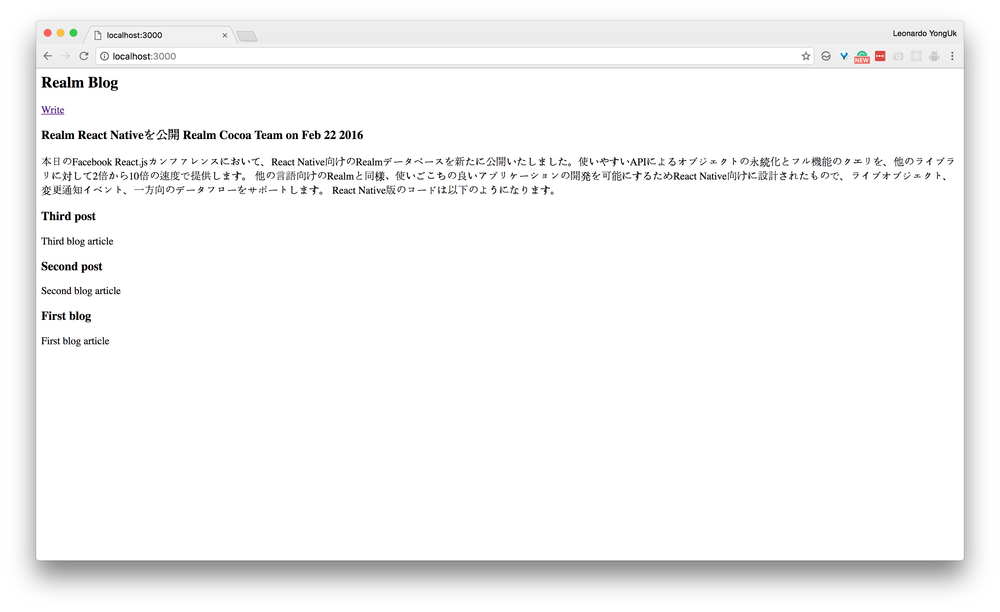

# Realm Node.js와 Express로 블로그 만들기

작성자: Leonardo YongUk Kim<lk@realm.io>

[Realm의 Node.js 버전이 11월 16일에 출시](https://realm.io/kr/news/first-object-database-realm-node-js-server/)되었습니다. Realm의 강력한 기능을 이제 서버 사이드에서 Node.js로 사용할 수 있게 되었습니다. Node.js에서 Realm을 활용하는 법을 보여주기 위해 간단한 블로그를 만들어 보겠습니다.

이 튜토리얼은 사용자가 쉘 환경을 사용할 수 있는 macOS나 리눅스 환경을 사용할 수 있다고 가정하고 있고 Node.js와 `npm`이 설치되어 있다고 가정하고 있습니다. 설치되어 있지 않다면 [Node.js 사이트](https://nodejs.org/ko/)를 참고하여 설치하세요.

## 기본 환경 설정하기

`realm-blog` 라는 디렉토리에서 시작하겠습니다.

```
mkdir realm-blog
cd realm-blog
```

먼저 Node.js 프로젝트를 초기화하기 위해 `npm init` 명령을 이용합니다.

```
$npm init
```

```
name: (realm-blog)
version: (1.0.0) 0.1.0
description: Realm Blog
entry point: (index.js)
test command:
git repository:
keywords:
author:
license: (ISC)
```

이후 물어보는 항목은 적절히 채웠습니다. `name` 항목은 디렉토리 명으로 지정되는데 그대로 두었고 버전은 `1.0.0`으로 하기에 민망한 수준이기 때문에 `0.1.0`으로 바꾸었습니다. 다른 항목들은 다 기본 값으로 설정하였습니다.

웹 요청을 처리하기 위해 Express, 데이터베이스를 위해 Realm Node.js, 템플릿 처리를 위해 Embedded JavaScript(EJS), 폼으로 전달된 쿼리를 처리하기 위해 body-parser를 사용합니다.

```
npm install --save express
npm install --save realm
npm install --save ejs
npm install --save body-parser
```

다음으로 코드를 수정할 때 마다 서버가 재 시작할 수 있도록 Nodemon을 설치합니다.

```
npm install --save-dev nodemon
```

이제 nodemon을 이용해서 서버를 수행하려면 `node_modules/nodemon/bin/nodemon.js index.js` 명령이면 됩니다. 이는 조금 번잡하니 조금 줄여보겠습니다.

```
{
  ...
  "scripts": {
    "serve": "nodemon index.js"
  },
  ...
}
```

이제 테스트 서버를 `npm run serve`로 수행할 수 있습니다.

## Hello Realm!

먼저 `/` 요청을 처리할 코드를 등록합시다.

```
'use strict';

var express = require('express');

var app = express();

app.get('/', function(req, res) {
  res.send("Hello Realm");
});

app.listen(3000, function() {
  console.log("Go!");
});
```

`/` 주소로 `GET` 요청이 올때 간단히 화면에 Hello Realm이라고 출력하고 `3000`번 포트를 통해 수행이 됩니다. 웹 브라우저에서 `localhost:3000`을 열어봅시다.


## 글쓰기 기능을 구현해봅시다.

이제 다음으로 글쓰기 기능을 구현해봅시다. 먼저 글쓰기 폼을 만듭시다. `write.html` 파일을 다음과 같이 만듭니다.

```
<form action="/write" method="POST">
  <input type="text" name="title" /><br />
  <textarea name="content"></textarea><br />
  <button type="submit">Submit</button>
</form>
```

`/write` 주소로 `GET` 요청이 올때 처리하기 위해 다음과 같이 추가합니다.

```
app.get('/write', function(req, res) {
  res.sendFile(__dirname + "/write.html");
});
```

`/write` 요청에 대해 현재 디렉토리의 `write.html` 파일을 화면에 출력합니다.

웹 브라우저에서 `localhost:3000/write` 요청을 해봅시다.


글을 작성하면 `/write` 주소로 `POST` 요청이 오는데 이를 처리하기 위해 POST 요청을 처리합시다. 먼저 `index.js`에 본문 파서를 추가합니다.

```
var express = require('express'),
  bodyParser = require('body-parser');

var app = express();

app.use(bodyParser.urlencoded({extended: true}));

app.post('/write', function(req, res) {
  res.send(req.body);
});
```

이제 `localhost:3000/write`에 접속하여 아무렇게나 입력해 봅시다. POST 요청에 대해 다음과 같이 출력되는 것을 볼 수 있습니다.

```
{"title":"nice","content":"to meet you"}
```

### Realm 스키마 만들기

Realm Node.js에서 스키마를 만들어봅시다.

```
var express = require('express'),
  bodyParser = require('body-parser'),
  Realm = require('realm');

var app = express();

let PostSchema = {
  name: 'Post',
  properties: {
    timestamp: 'date',
    title: 'string',
    content: 'string'
  }
};

var blogRealm = new Realm({
  path: 'blog.realm',
  schema: [PostSchema]
});
```

크게 주목해야할 부분은 두가지 부분이다. 먼저 `PostSchema`를 만들었습니다. 여기에 두 속성이 있는데 하나는 모델의 이름인 `name`이며 처음 만든 모델의 이름은 `Post`로 지정하였습니다. 그 안에 들어갈 속성은 `properties`에 넣는데 3가지 속성 `timestamp`, `title`, `content`을 선언했습니다.

이렇게 만든 스키마는 Realm 인스턴스를 만들때 생성자에 전달합니다. `path` 속성은 데이타베이스 파일명이 되고 `schema` 속성은 `Post` 모델을 비롯한 여러 모델등을 위한 스키마의 배열이 된다. 우리는 여기에서 `[PostSchema]`로 하나만 사용합니다. 복수 개의 스키마를 등록하는 경우에는 배열에 순차적으로 추가하면 됩니다.

### Realm에서 데이터 쓰기

글을 작성하기 위해 `/write` 주소에 대한 `POST` 핸들러를 다음과 같이 수정합시다.

```
app.post('/write', function(req, res) {
  let title = req.body['title'],
    content = req.body['content'],
    timestamp = new Date();
  blogRealm.write(() => {
    blogRealm.create('Post', {title: title, content: content, timestamp: timestamp});
  });
  res.sendFile(__dirname + "/write-complete.html");
});
```

Realm 인스턴스에 대해 `write` 메서드로 쓰기 트랜잭션을 열고 기록은 `create` 메서드를 통해 합니다. 화면 구성을 위해 `write-complete.html`은 다음과 같이 구성합시다.

```
<a href="/">Success!</a>
```

## 작성된 글 표현하기

이제 메인 화면에서 작성된 글을 가져와 출력합시다.

`views` 디렉토리에 `index.ejs`를 만듭니다.

```
<h2>Realm Blog</h2>

<a href="/write">Write</a>

<% for(var i=0; i<posts.length; i++) {%>
<h3><%= posts[i].title%></h3>
<p><%= posts[i].content%></p>
<% } %>
```

이는 `posts`로 전달 받은 블로그 포스트를 연달아 출력하는 템플릿입니다.

템플릿에 `posts`를 전달하기 위해 수정된 핸들러는 아래와 같습니다.

```
app.set('view engine', 'ejs');

app.get('/', function(req, res) {
  let posts = blogRealm.objects('Post').sorted('timestamp', true);
  res.render('index.ejs', {posts: posts});
});
```

`app.set`을 이용해서 우리가 Embedded Javascript(EJS) 템플릿 엔진을 사용할 것임을 알렸습니다. 전체 `Post` 글을 가져왔는데 `timestampe`의 역순으로 (`sorted`의 두번째 인자가 `reverse` 옵션입니다. 생략하면 순서대로 정렬합니다.) 가져옵니다. 역순으로 가져온 이유는 블로그이기 때문입니다.

이제 실행하고 `Write`를 통해 글을 작성해보면 아래와 같은 화면을 볼 수 있습니다.



[전체 예제는 여기](https://github.com/dalinaum/realm-blog)에서 확인할 수 있습니다.
